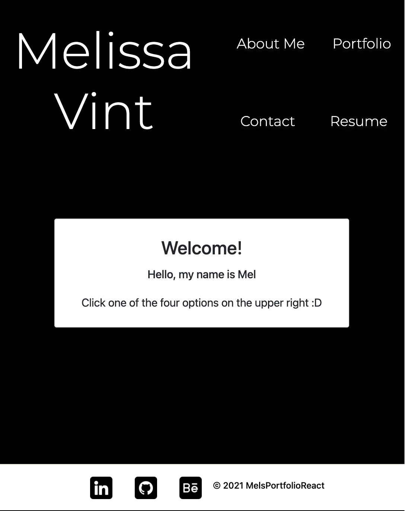
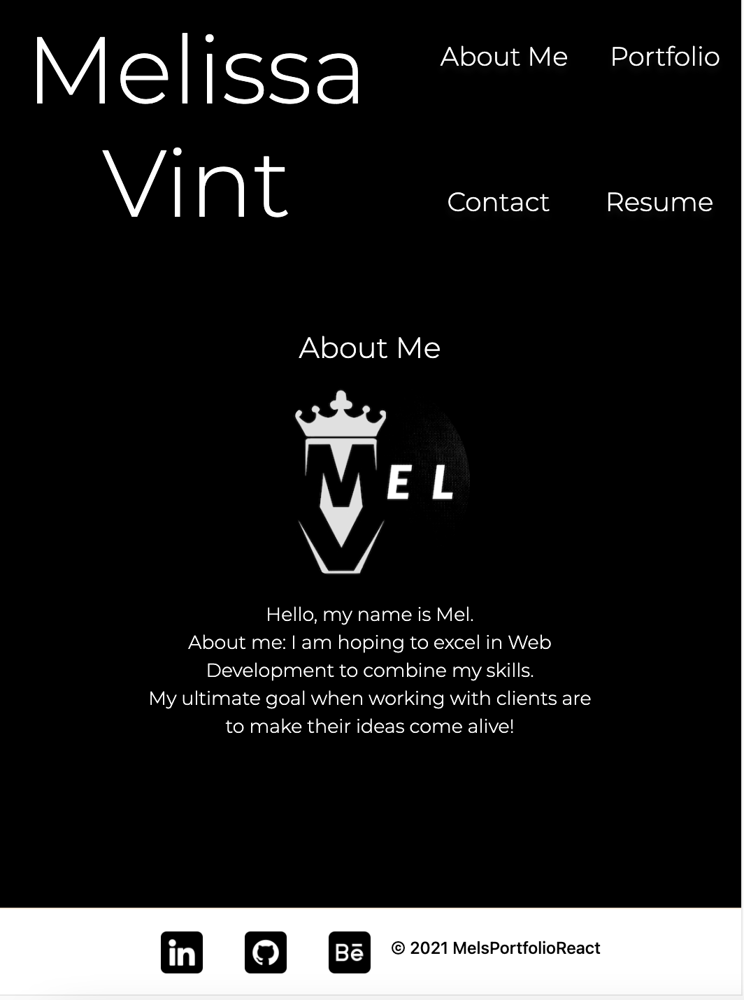
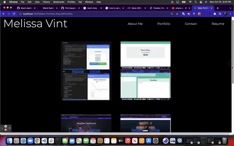

## Mels Portfolio using React.js
 
 

## Link to live site
[*Mels Portfolio*](https://blooming-temple-17915.herokuapp.com/)
 
 

## Questions
Checkout my GitHub [profile](https://github.com/mvint2647)

Please feel free to email at: <Melissavinny1133@gmail.com>
 
 
## InfoAboutMe
Link to Resume [Resume](https://docs.google.com/document/d/1c5mCvN6fnfzin5IoNwUj3H1cxR4FBLpj08U04_uMDYA/edit?usp=sharing)
 
 
## Screenshots

 
 
 
 
 
 

# Getting Started with Create React App

This project was bootstrapped with [Create React App](https://github.com/facebook/create-react-app).

## Available Scripts

In the project directory, you can run:

### `npm start`

Runs the app in the development mode.\
Open [http://localhost:3000](http://localhost:3000) to view it in the browser.

<!-- ---------------------------------------------------------------------------------------------------- -->